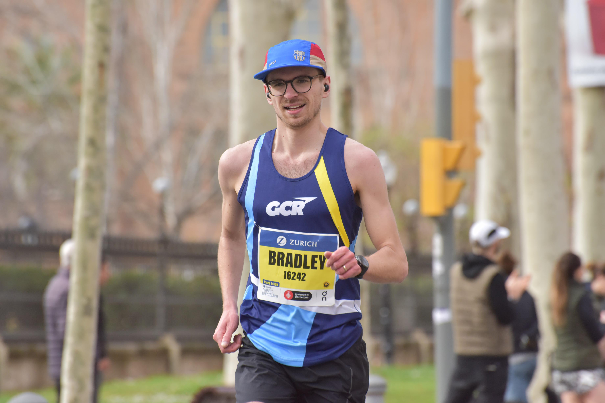

Before running the Barcelona Marathon, I hadn’t run a marathon since 2021. That year, I ran the London Marathon, and it didn’t go well. I hobbled over the finish line with cramps in both calves and hamstrings. That race is a story for another day. London was so tough that it put me off running marathons for a few years.

In early 2023, though, my sisters-in-law had started getting into running and suggested we run a marathon together. I had been getting back into running more seriously and thought it might be time to try again. After some research, we settled on Barcelona—where we could enjoy a holiday as well. The weather would be pleasant, the beach was nearby, and it wouldn’t be too expensive.

The race was set for March 10, 2024, in the heart of Barcelona. We all had about eight months to plan and start training.

### My Training

Early on, I knew I had to get my training right. For London, I had been lax, and I paid for it dearly. I didn’t want to pay for a coach, so I researched training plans. At the start of the year, I aimed to run a 2:35:00—quite an improvement on my London time of 3:02:00—but I felt in good shape. I also had a few friends at my local running club I wanted to beat!

I decided to follow Runner’s World’s ["Mission Marathon Training Plan: sub-3 hours"](https://www.runnersworld.com/uk/training/marathon/a776660/mission-marathon-training-plan-sub-3-hours/). It turned out to be a fantastically detailed and well-thought-out plan, which included strength training, hill reps, and some challenging long runs. I adjusted the paces slightly for my target time, and the 12-week program was thoroughly enjoyable.

I trained through winter, coinciding with the cross-country season. This meant I had a few runs where I slogged through mud and then ran home! Just like this one:

 <iframe src='https://connect.garmin.com/modern/activity/embed/13402253511' title='St Albans Running' width='465' height='500' frameborder='0'></iframe> 

My longest run of the plan was incredible and boosted my confidence to new heights. It was at this stage that I thought I could go sub-2:30:00. The run totaled 38 km, broken into 4 x 7 km at marathon pace with 2 km jogs in between. It was a tough session, with a serious hill right in the middle, but I managed it. Moving forward, this will always be part of my marathon training.

 <iframe src='https://connect.garmin.com/modern/activity/embed/13910367949' title='Derbyshire Dales Running' width='465' height='500' frameborder='0'></iframe> 

### Pre-Race

We flew into Barcelona on March 8, which gave us plenty of time to go to the expo, do a shakeout run, and see some tourist sights. Barcelona is a superb city. We visited the Sagrada Família, La Rambla, and the Arc de Triomf.

Unfortunately, it was pouring rain on Saturday. The 5 km shakeout run was wet, but everyone was in high spirits. The website suggests signing up for this run, but plenty of people just showed up and joined in.

Afterward, we went to the expo to pick up our bibs and t-shirts. The expo was busy but not crowded, with lots of stalls. We even got free socks from On Running!

The atmosphere at the expo and around the city was buzzing. We had an early dinner at a delicious Italian place and were in bed by 8:00 PM.
### Race Day

Race day arrived, and the clouds had parted—the sun was shining. We were up early, around 5:30 AM, to have breakfast. With the race starting at 8:30, we wanted to be properly fueled. Thankfully, our hotel was only a 20-minute walk from the start line, so we weren’t stressed or rushed. Bag drop was easy, and there were plenty of toilets at the start.

I started well, planning to take a gel every 20 minutes. These gels had 25g of carbs, and I hoped they’d help prevent cramps. I flew through the first half of the race in about 1:13:00, feeling great. The support was great, with lots of cheering. There were also plenty of aid stations offering water, isotonic drinks, and gels. The race-provided gels had 50g of carbs and were a lifesaver toward the end of the race.

The course winds all around Barcelona and is mostly flat. You pass landmarks like the Sagrada Família, the beach, and many Art Deco buildings.

After reaching the halfway point, the field thinned out a bit. This is where mental toughness comes into play. I felt strong and picked up the pace, but around the 35 km mark, I started feeling cramps in my right calf. Heartbreaking! The one thing I trained so hard to avoid had struck. With plenty of race left, I had to adapt. I slowed my pace, checked my remaining gels, and decided to take them every 15 minutes. I’d speed up after a gel and ease off before the next one. Despite cramping in my left calf and hamstrings, I pushed through and finished in 2:29:50! I collapsed in pain but was ecstatic with the time.

Here’s how my race looked:

 <iframe src='https://connect.garmin.com/modern/activity/embed/14340231471' title='Barcelona Running' width='465' height='500' frameborder='0'></iframe> 

My sisters-in-law finished in a stunning 5:09:23!
### Post-Race

There wasn’t much in the way of a recovery zone after the race, but the medal is really nice. They offered the usual orange slices, bananas, and sports drinks for recovery. The race finishes at the Arc de Triomf, a beautiful spot to end with runners, friends, and family celebrating together.

### Final Thoughts

The Barcelona Marathon was amazing and the best race of my life. We flew home Monday evening after enjoying a beautiful day on La Rambla. I’d 100% recommend this race to anyone looking for a flat, fast, and warm marathon.